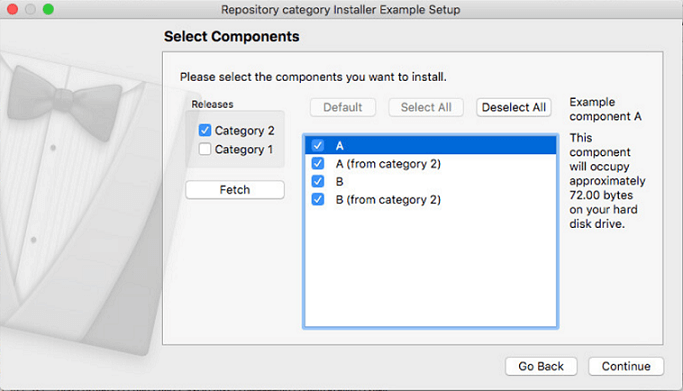

创建脱机和联机安装程序需要执行以下步骤：

1. 为可安装组件创建一个软件包目录。有关更多信息，请参见软件包目录。
2. config.xml在config目录中创建一个配置文件。它包含有关如何构建安装程序二进制文件和联机存储库的信息。有关文件格式和可用设置的更多信息，请参阅“ 配置文件”。
3. package.xml在config\meta目录中创建一个包信息文件。它包含用于部署和安装过程的设置。有关更多信息，请参见Meta Directory。
4. 创建安装程序内容并将其复制到软件包目录。有关更多信息，请参见数据目录。
5. 对于在线安装程序，请使用该repogen工具来创建包含可安装内容的存储库，然后将该存储库上载到Web服务器。
6. 使用该binarycreator工具创建安装程序。有关更多信息，请参见工具。

以下各节描述如何创建不同类型的安装程序：

* 创建离线安装程序
* 创建在线安装程序
* 促进更新
* 定制安装程序

### 创建离线安装程序

脱机安装程序在安装过程中根本不会尝试连接到在线存储库。但是，元数据配置（config.xml）使用户可以在线添加和更新组件。

在公司防火墙不允许最终用户连接到Web服务器的情况下，脱机安装程序特别有用。网络管理员可以在网络内设置本地更新服务。

要创建脱机安装程序，请使用--offline-only该binarycreator工具的选项。

要在Windows中创建脱机安装程序，请输入以下命令：

```
<location-of-ifw>\binarycreator.exe --offline-only -t <location-of-ifw>\installerbase.exe -p <package_directory> -c <config_directory>\<config_file> <installer_name>
```

一些选项具有默认值，因此您可以忽略它们。例如，输入以下命令以创建名为SDKInstaller.exe的安装程序二进制文件，其中包含由org.qt-project.sdk标识的软件包及其依赖项：

```
binarycreator.exe --offline-only -c installer-config -p installer-packes SDKInstaller.exe
```

### 创建在线安装程序

联机安装程序除了存储二进制文件中的内容外，还获取存储库描述（Updates.xml）。创建一个存储库并将其上传到Web服务器。然后在用于创建安装程序的config.xml文件中指定存储库的位置。

#### 创建存储库

使用该repogen工具创建一个软件包目录中所有软件包的在线存储库：

```
repogen.exe -p <package_directory> <repository_directory>
```

例如，要创建仅包含org.qt-project.sdk.qt和org.qt-project.sdk.qtcreator的存储库，请输入以下命令：

```
repogen.exe -p packages -i org.qt-project.sdk.qt,org.qt-project.sdk.qtcreator repository
```

创建存储库后，将其上传到Web服务器。您必须在安装程序配置文件中指定存储库的位置。

### 配置存储库

<RemoteRepositories>安装程序配置文件（config.xml）中的元素可以包含几个存储库的列表。它们每个都可以具有以下设置：

* <Url>, 指向可用组件的列表。
* <Enabled>, 其中0停用此存储库。
* <Username>, 用作受保护存储库上的用户。
* <Password>, 它设置要在受保护的存储库上使用的密码。
* <DisplayName>, 可以选择设置要显示的字符串而不是URL。


该URL需要指向列出可用组件的Updates.xml文件。例如：

```
<RemoteRepositories>
    <Repository>
            <Url>http://www.example.com/packages</Url>
            <Enabled>1</Enabled>
            <Username>user</Username>
            <Password>password</Password>
            <DisplayName>Example repository</DisplayName>
    </Repository>
</RemoteRepositories>
```

仅当安装程序可以访问存储库时，它才能工作。如果在安装后访问存储库，则维护工具将拒绝安装。但是，仍然可以卸载。默认情况下，可以启用或禁用存储库。对于需要身份验证的存储库，也可以在此处设置详细信息，尽管通常不建议在此处输入密码，因为它以纯文本格式保存。此处未设置的身份验证详细信息将在运行时使用对话框获取。用户可以在运行时解决这些设置。

### 配置存储库类别

所述<RepositoryCategory>安装程序配置文件（config.xml）在元件可以包含多个列表<RemoteRepositories>元素。<RemoteRepositories>元素内的每个元素都<RepositoryCagetory>被视为一个类别。每个目录都可以具有<DisplayName>，一个 <Tooltip>，一个<Preselected>元素和几个<Repository>元素。存储库类别显示在组件选择小部件左侧的组件选择页面中：



默认情况下，组件选择窗口小部件中仅显示没有类别的存储库。检查一个或几个存储库并按Fetch（获取）将更新小部件以显示来自选定分类存储库的内容。存储库类别中的组件被标记为不稳定，这意味着您可以安装其他组件，尽管某些组件缺少依赖项，脚本错误等。有关不稳定组件的更多信息，请参阅“配置文件元素摘要”。

创建存储库类别的示例：

```
<RepositoryCategories>
    <RemoteRepositories>
        <Displayname>Category 1</Displayname>
        <Preselected>true</Preselected>
        <Tooltip>Tooltip for category 1</Tooltip>
        <Repository>
                <Url>http://www.example.com/packages</Url>
                <Enabled>1</Enabled>
                <Username>user</Username>
                <Password>password</Password>
                <DisplayName>Example repository</DisplayName>
        </Repository>
    </RemoteRepositories>
</RepositoryCategories>
```

### 创建安装程序二进制文件

要使用该binarycreator工具创建在线安装程序，请输入以下命令：

```
<location-of-ifw>\binarycreator.exe -t <location-of-ifw>\installerbase.exe -p <package_directory> -c <config_directory>\<config_file> -e <packages> <installer_name>
```

例如，输入以下命令以创建名为SDKInstaller.exe的安装程序二进制文件，该文件将不包含org.qt-project.sdk.qt和org.qt-project.qtcreator的数据，因为这些软件包是从远程存储库下载的：

```
binarycreator.exe -p installer-packages -c installer-config\config.xml -e org.qt-project.sdk.qt,org.qt-project.qtcreator SDKInstaller.exe
```


### 减少安装程序大小

即使从Web服务器获取了组件binarycreator，默认情况下也会将它们添加到安装程序二进制文件中。但是，当安装程序检查Web服务器上的更新时，如果新版本不可用，最终用户将免于下载。

或者，您可以创建不包含任何数据并且从Web服务器获取所有数据的在线安装程序。使用工具的-n参数，binarycreator仅将根组件添加到安装程序中。通常，根组件为空，因此仅添加根的XML描述。

有关您拥有的选项的更多信息，请参见binarycreator参数摘要。